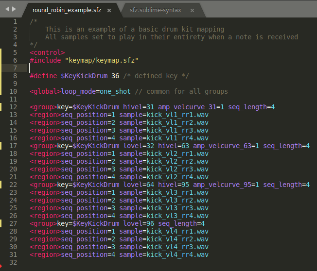

# SFZ Format Filetype Syntax Highlighting for Sublime Text

This [Sublime Text](https://www.sublimetext.com/) configuration file will add
syntax highlighting for [SFZ Format](https://sfzformat.com) file editing.

## Installation

- Copy `sfz.sublime-syntax` in `$HOME/.config/sublime-text-3/Packages/User`

## Known Bugs

- Opcode using defined ***$variables*** are not highlighted properly
- Opcodes are not filtered so there is no opcode recognition (yet)
